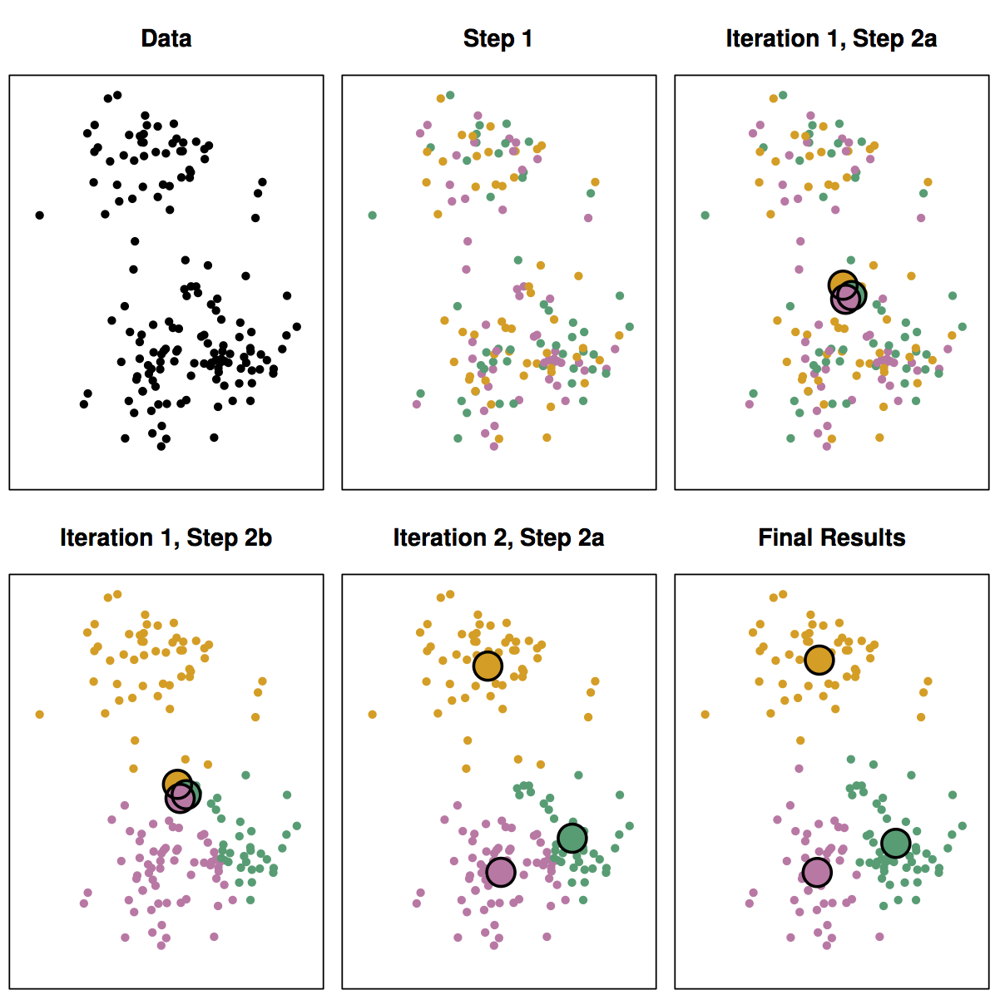

# Markdown Examples

Lessons are written in markdown. You can see a number of examples of markdown syntax in this file.

You can view a complete list of available Learn custom markdown elements by running `learn md` and looking under the 'Other Markdown' section.

File headers can be written to define attributes for the content file itself, which are under the 'Files' section.

You can use a bare minimum template with the `-m` flag.

## Link to other content in Learn

Links to other markdown files in the repository will navigate within Learn. Write them with a relative path in the repo. For example:

[This is a link to the Challenge Examples file in this repository `04-challenges.md`.](04-challenges.md)

Links to lessons in other repos are possible by using permalinks. Once a block of curriculum is [published](02-publishing.md) and available on a cohort, each content file will have a chain link icon at the top available to instructors and administrators.

Clicking this link will reveal the option to 'Copy page permalink' to your clipboard. Here is an example permalink you can copy:

```
https://learn-2.galvanize.com/content_link/github.com/gSchool/learn-content/other-challenge-attributes.md
```

## Link (external)

Links to external content should be absolute links, starting with `http://` or `https://`

[Google](https://www.google.com/)

[Curriculum on github/gSchool](https://github.com/gSchool)

*The markdown examples here are not necessary to read to continue the walkthrough. Read them for reference and to see what's possible with Learn markdown.

## Callouts

Callouts are Learn rendered sections of content to highlight 

### !callout-info
This information is the most important thing to read on the page!
### !end-callout

### !callout-warning
Warnings don't really mean much when you know Danger is still an option.
### !end-callout

### !callout-danger
You should probably do what this says.
### !end-callout

### !callout-success
Yay?
### !end-callout

### !callout-secondary
When grayscale is your style.
### !end-callout

### !callout-star
Purple for when you want things to pop!
### !end-callout

# H1 Top-Level Heading

Galvanize is committed to creating opportunities for Veterans to gain the skills and knowledge they need to enter the tech industry after service to their country. As Veterans Day approaches, we’ll be chronicling the stories…

## H2 Next-Level Heading

At Galvanize, we’re putting a whole new spin on Study Hall with monthly sessions. At every Study Hall, industry all-stars present on one of three topics –– growth, funding, or product –– and collaborate…

### H3 Next-Level Heading

Just before Christmas last year, 41-year-old Chad Latham received a call from his lawyer. He had news from the President of the United States. At the time, Latham was in a 500-square-foot circle in a…

#### H4 Next-Level Heading

Kendra Lyndon wasn’t always interested in a career in web development. She spent years studying classical piano and earned her bachelor’s degree in music before taking on a role as an office assistant for a retail…

##### H5 Next-Level Heading

So you’ve gotten to know what personal branding is, you've developed a brand profile based on your strengths, and figured out how to customize your resume for each job without losing your uniqueness. What to do…

###### H6 Next-Level Heading

Before he joined the Galvanize Web Development Immersive Program, former US Army Sgt. Allen Fordham traveled the world in search of his passion. Growing up, Allen’s family moved a lot; he had lived in six…

## Emphasis

Words can have *emphasis*, **strong emphasis**, or ~~strikethrough~~.

## Lists

Numbered

1. first
1. second
1. third

Bulleted with `*`

* one
* two
* three

Bulleted with `-`

- one
- two
- three

## Images

Images included in your repo will be automatically uploaded to S3 for display on Learn.

The following image is placed inline .

The same image is on it's own line.


Large images will be scaled to fit the content column.



## Images links <br>

This logo is a clickable link

[](https://www.github.com)

## Video embedded with a markdown tag

### !vimeo
* id: 237762731
### !end-vimeo

## Video embedded with an iframe

<iframe src="https://player.vimeo.com/video/220071098?byline=0&portrait=0" width="640" height="360" frameborder="0" webkitallowfullscreen mozallowfullscreen allowfullscreen></iframe>

## Tables

Here is a table with a header row

| Tables        | Are           | Cool  |
| ------------- |---------------| ------|
| enterprise    | dsi           | wdi   |

## Blockquotes

> ## Look a heading in a blockquote!
> This is a very long line that will still be quoted properly when it wraps. Oh boy let's keep writing to make sure this is long enough to actually wrap for everyone.


## Rendering LaTeX for Math equations

Block-style LaTeX supported.

$$x = {-b \pm \sqrt{b^2-4ac} \over 2a}.$$

Inline LaTeX \( z^2 = x^2 + y^2 \) is also supported, but the delimiters are `\( and \)` to avoid conflicts over the use of single `$`.

## Syntax Highlighting

Inline `code` has single back-ticks around it.

Code blocks are surrounded by have triple back-ticks, including the language for the correct syntax highlighting.

```java
/** java example from https://highlightjs.org/static/demo/ **/

/**
 * @author John Smith <john.smith@example.com>
*/
package l2f.gameserver.model;

public abstract class L2Char extends L2Object {
  public static final Short ERROR = 0x0001;

  public void moveTo(int x, int y, int z) {
    _ai = null;
    log("Should not be called");
    if (1 > 5) { // wtf!?
      return;
    }
  }
}
```

```js
// JS example from https://highlightjs.org/static/demo/

function $initHighlight(block, cls) {
  try {
    if (cls.search(/\bno\-highlight\b/) != -1)
      return process(block, true, 0x0F) +
             ` class="${cls}"`;
  } catch (e) {
    /* handle exception */
  }
  for (var i = 0 / 2; i < classes.length; i++) {
    if (checkCondition(classes[i]) === undefined)
      console.log('undefined');
  }
}

export  $initHighlight;
```

```python
# Python example from https://highlightjs.org/static/demo/

@requires_authorization
def somefunc(param1='', param2=0):
    r'''A docstring'''
    if param1 > param2: # interesting
        print 'Gre\'ater'
    return (param2 - param1 + 1 + 0b10l) or None

class SomeClass:
    pass

>>> message = '''interpreter
... prompt'''
```

```CSS
/* CSS example from https://highlightjs.org/static/demo/ */

@font-face {
  font-family: Chunkfive; src: url('Chunkfive.otf');
}

body, .usertext {
  color: #F0F0F0; background: #600;
  font-family: Chunkfive, sans;
}

@import url(print.css);
@media print {
  a[href^=http]::after {
    content: attr(href)
  }
}
```

```html
<!-- HTML example from https://highlightjs.org/static/demo/ -->

<!DOCTYPE html>
<title>Title</title>

<style>body {width: 500px;}</style>

<script type="application/javascript">
  function $init() {return true;}
</script>

<body>
  <p checked class="title" id='title'>Title</p>
  <!-- here goes the rest of the page -->
</body>

```

```jsx
// React example from https://learn-2.galvanize.com/cohorts/625/blocks/6/content_files/components/events-and-state.md

class Echo extends React.Component {

  constructor(props) {
    super(props)
    this.state = { greeting: props.original }
  }

  inputWasChanged = (e) => {
    this.setState({greeting: e.target.value})
  }

  render() {
    return (
      <div className="container">
        <p>
          <input
            value={ this.state.greeting }
            onChange={ this.inputWasChanged }
            />
        </p>
        { this.state.greeting }
      </div>
    )
  }

}
```

```
Just text

For data point in training set:
    calculate distance from data point to new_value
Order distances in increasing order and take the first k
Make the prediction

No language indicated, so no syntax highlighting.
But let's throw in a <b>tag</b>.
```
